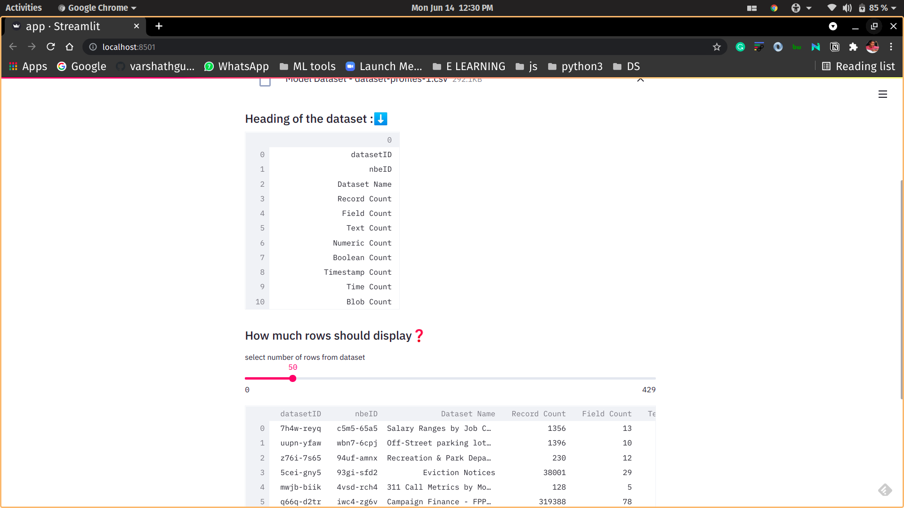

# Grootan Assignment
 Hello grootans! This is **Varshath Gupta S** from **PSNACET**, 
 I have completed my assignment and these are the aditional details of my assignment.
 ## Video of my assignment
 

 ## Assignment can be seen in two ways.

 ### 1) In heruko
  I have deploy my assignment in heruko, you view by clicking
  [App on herukp](https://grooton-assignment.herokuapp.com/)

  ### 2) By using local host

  For that you must clone my rep
  ```bash
  git clone https://github.com/varshathgupta/grootan_assignment.git
```
Once cloned, Install the requirements by,

```bash
pip install -r requirements.txt 
```

After requirements installed, run  the app using
```bash
  streamlit run app.py

```
Now my app is open in the browser.


Upload data set either by *browse* or *drag and drop*


Once it uploaded it shows the *heading of the dataset*.


Finally you can select how many rows to display by using slider,


## Technology Stack

1. Python3
2. Streamlit
3. Pandas

## License
[MIT](https://choosealicense.com/licenses/mit/)